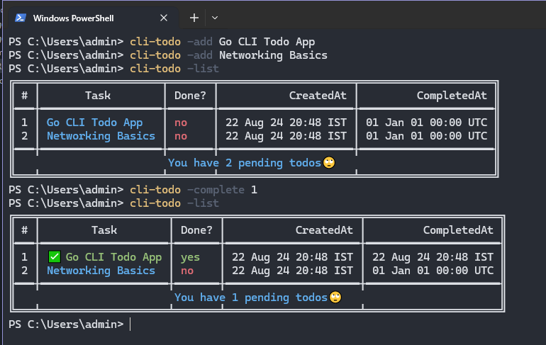

# CLI Todo Application

- This is a simple command-line interface (CLI) application for managing a todo list. 
- You can add, complete, delete, and list tasks directly from your terminal.



## Features

- **Add**: Add a new todo item to your list.
- **Complete**: Mark an existing todo item as completed.
- **Delete**: Remove a todo item from your list.
- **List**: Print out all todo items in a formatted table.

## Installation

1. **Clone the repository**:
   ```bash
   git clone https://github.com/kasodeep/cli-todo.git
   ```

2. **Build the application**:
   ```bash
   cd cli-todo
   go build
   ```

## Storage

- The files are stored in the `.todos.json` file.

## Usage
```bash
# Add a todo
./clitodo -add "Buy groceries"

# Add another todo
./clitodo -add "Write blog post"

# List all todos
./clitodo -list

# Complete the first todo
./clitodo -complete 1

# Delete the second todo
./clitodo -del 2

# List all todos
./clitodo -list
```

## Install
```bash
# To run the todo list app anywhere in the system.
# Make sure to add the .todos.json in the bin folder of Go.
go install
```

